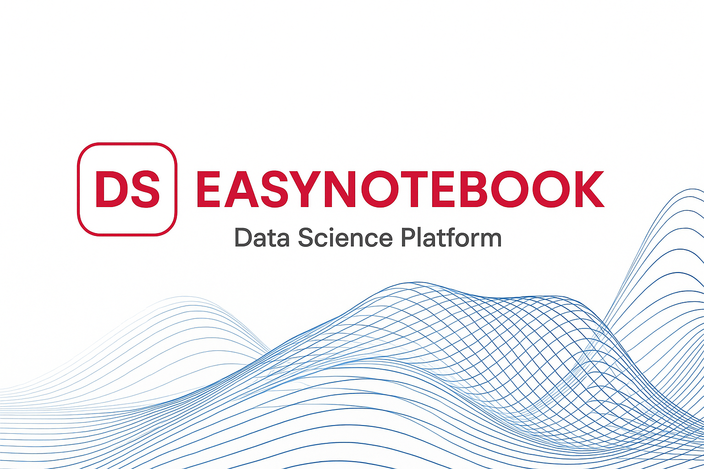

**EasyNotebook** is an AI-powered, transparent, and interactive data science platform that helps users seamlessly integrate automation with full control. Designed with a **stateless architecture**, it enables step-by-step scenario workflows where AI agents assist—but never override—human decisions. Whether you’re exploring datasets, cleaning data, or building pipelines, EasyNotebook is your reliable copilot for faster, smarter work.

> **Motto:** *Make AI enhance our work — AI For ALL*

---

🌈 Contribution Guidelines

We welcome contributions from everyone! Here’s how you can get involved:

* 🛠 **Develop features**: Check our [issues](https://github.com/your-org/easynotebook/issues) for feature requests or bugs.
* 🧪 **Test new components**: Help us test usability and performance across different browsers and datasets.
* ✨ **Improve UI/UX**: If you love design, we’d love your ideas for improving the user interface!
* 🧾 **Write docs or tutorials**: Share your workflows and lessons learned using EasyNotebook.

👩‍💻 Useful Resources

* 📚 **Documentation**: [https://easy-notebook.silan.tech/docs](https://easy-notebook.silan.tech/docs)
* 🎥 **Live Demo**: [easy-notebook.silan.tech](https://easy-notebook.silan.tech)
* 🧠 **Technical Architecture**: Learn about our stateless execution model and AI planning [here](https://example.com/whitepaper)
